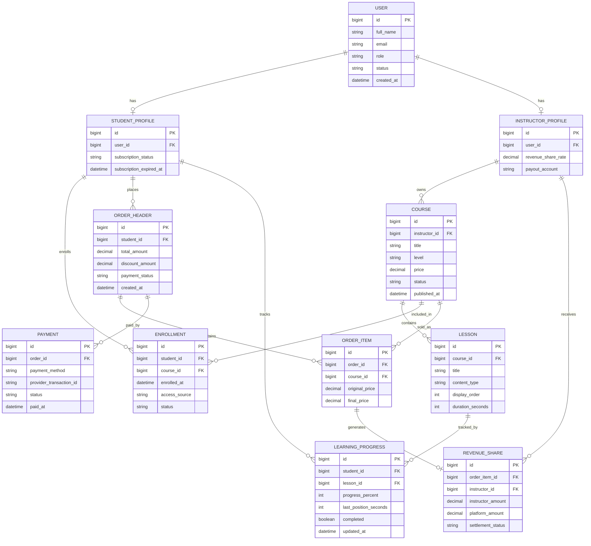

# BÁO CÁO HACKATHON AI APPLICATION IN ACTION - ĐỀ 004

## Thông tin bài làm

- Sinh viên: Nguyễn Quyết Thắng
- Lớp: CNTT3_IT212
- Mã đề: 004
- Môn học: AI Application in Action
- IDE sử dụng: IntelliJ IDEA
- Build tool: Gradle
- Ngôn ngữ: Java 17
- Framework: Spring Boot

---

# 1. Mục tiêu kỹ thuật

Bài làm giải quyết 3 nhóm yêu cầu chính của đề Hackathon 004:

1. Tái cấu trúc logic ghi danh khóa học để dễ mở rộng.
2. Debug lỗi bảo mật JWT khiến hệ thống trả HTTP 500 khi thiếu token.
3. Phân tích và thiết kế hệ thống Rikkei LMS bằng AI.

Giải pháp kỹ thuật được chọn:

- Sử dụng Java 17 và Spring Boot để tổ chức source code theo hướng production-ready.
- Sử dụng Gradle để quản lý dependency và chạy test.
- Sử dụng Strategy Pattern và Dependency Injection để tách logic khuyến mãi, thanh toán, cấp quyền và thông báo.
- Sử dụng Spring Security, `AuthenticationEntryPoint` và `AccessDeniedHandler` để chuẩn hóa lỗi xác thực thành JSON response.
- Sử dụng Mermaid để thiết kế ERD cho hệ thống Rikkei LMS.

---

# 2. Cấu trúc thư mục

```text
CNTT3_IT212_NguyenQuyetThang_Hackathon_04
├── build.gradle
├── settings.gradle
├── HELP.md
├── src
│   ├── main
│   │   └── java
│   │       └── com
│   │           └── rikkei
│   │               └── hackathon
│   │                   ├── HackathonApplication.java
│   │                   ├── refactoring
│   │                   └── security
│   └── test
│       └── java
│           └── com
│               └── rikkei
│                   └── hackathon
│                       ├── refactoring
│                       └── security
├── docs
│   ├── erd_diagram.png
│   └── erd_diagram.mmd
├── README.md
└── .gitignore
```

---

# 3. Hướng dẫn mở bằng IntelliJ IDEA

1. Mở IntelliJ IDEA.
2. Chọn `Open`.
3. Chọn thư mục `CNTT3_IT212_NguyenQuyetThang_Hackathon_04`.
4. IntelliJ tự nhận diện file `build.gradle` và import Gradle project.
5. Chọn JDK 17 cho project SDK.
6. Chạy test bằng Gradle task `test` hoặc dùng Terminal:

```bash
gradle test
```

Nếu có Gradle Wrapper trên máy, có thể chạy:

```bash
./gradlew test
```

---

# 4. PHẦN 1 - Tái cấu trúc hệ thống để dễ mở rộng

## 4.1. Vấn đề ban đầu

Code cũ của `EnrollmentService` đang gộp nhiều trách nhiệm trong cùng một hàm:

- Tính học phí.
- Xử lý coupon.
- Xử lý payment method.
- Cấp quyền truy cập khóa học.
- Gửi email thông báo.

Điều này làm hàm `enroll()` vi phạm các nguyên tắc thiết kế như:

- Single Responsibility Principle.
- Open/Closed Principle.
- Dependency Inversion Principle.

Nếu thêm coupon mới, payment method mới hoặc notification channel mới, developer phải sửa trực tiếp hàm lõi. Việc này dễ gây regression bug.

## 4.2. Prompt Chain đã sử dụng

### Prompt 1 - Phân tích lỗi thiết kế

```text
Đóng vai Senior Java Architect.
Hãy phân tích đoạn code EnrollmentService dưới góc nhìn SOLID và Clean Code.
Chỉ ra các trách nhiệm đang bị gộp chung, rủi ro khi mở rộng coupon/payment/notification,
và đề xuất hướng refactor để hàm enroll không phải sửa khi thêm nghiệp vụ mới.
```

### Prompt 2 - Tách kiến trúc bằng Strategy Pattern

```text
Dựa trên phân tích trên, hãy refactor EnrollmentService bằng Java 17 và Spring Boot.
Yêu cầu:
- Tách coupon thành CouponPolicy.
- Tách payment thành PaymentProcessor.
- Tách cấp quyền thành AccessGrantService.
- Tách thông báo thành NotificationService.
- EnrollmentService chỉ điều phối flow, không chứa if-else theo coupon/payment.
- Thêm ví dụ payment method INSTALLMENT để chứng minh khả năng mở rộng.
```

### Prompt 3 - Review lại code sinh ra

```text
Hãy review lại code refactor vừa sinh.
Kiểm tra xem khi thêm coupon mới hoặc payment method mới có cần sửa EnrollmentService không.
Nếu còn if-else hoặc switch trong hàm lõi, hãy sửa lại theo hướng registry/strategy.
```

## 4.3. Giải pháp đã triển khai

Các thành phần chính:

- `EnrollmentService`: chỉ điều phối flow ghi danh.
- `CouponPolicy`: interface cho chiến lược khuyến mãi.
- `EarlyBirdCouponPolicy`: giảm còn 70% học phí.
- `AlumniCouponPolicy`: giảm trực tiếp 500.000 VNĐ.
- `PaymentProcessor`: interface cho phương thức thanh toán.
- `StripePaymentProcessor`: xử lý thẻ quốc tế.
- `BankTransferPaymentProcessor`: xử lý chuyển khoản.
- `InstallmentPaymentProcessor`: phương thức trả góp mới.
- `AccessGrantService`: cấp quyền truy cập khóa học.
- `NotificationService`: gửi thông báo sau khi ghi danh.

## 4.4. Code lõi sau refactor

```java
@Service
public class EnrollmentService {
    private final CouponPolicyRegistry couponPolicyRegistry;
    private final PaymentProcessorRegistry paymentProcessorRegistry;
    private final AccessGrantService accessGrantService;
    private final NotificationService notificationService;

    public Enrollment enroll(Student student, Course course, String coupon, String paymentType) {
        double finalFee = couponPolicyRegistry.findPolicy(coupon).apply(course.getPrice());
        paymentProcessorRegistry.findProcessor(paymentType).process(student, course, finalFee);
        accessGrantService.grantCourseAccess(student, course);
        notificationService.sendEnrollmentSuccess(student, course);
        return new Enrollment(student, course, finalFee);
    }
}
```

## 4.5. Vì sao giải pháp dễ mở rộng

- Thêm coupon mới: tạo class mới implement `CouponPolicy`.
- Thêm payment mới: tạo class mới implement `PaymentProcessor`.
- Thay đổi notification: tạo implementation mới của `NotificationService`.
- Không cần sửa hàm lõi `EnrollmentService.enroll()`.

---

# 5. PHẦN 2 - Debugging bảo mật và xử lý lỗi hệ thống

## 5.1. Root Cause

Log lỗi:

```text
java.lang.NullPointerException: Cannot invoke "String.substring(int)" because "authHeader" is null
```

Nguyên nhân gốc rễ:

- Request không có header `Authorization`.
- Code cũ gọi trực tiếp `authHeader.substring(7)`.
- Vì `authHeader == null`, hệ thống ném `NullPointerException`.
- Lỗi không được chuyển thành `AuthenticationException` hoặc xử lý bởi Spring Security.
- Kết quả là server trả HTTP 500 thay vì 401 Unauthorized.

## 5.2. Prompt Chain đã sử dụng

### Prompt 1 - Điều tra lỗi

```text
Đóng vai Senior Spring Security Engineer.
Hãy phân tích nguyên nhân gốc rễ của lỗi NullPointerException trong JwtAuthenticationFilter.
Vì sao thiếu Authorization header lại làm server trả HTTP 500 thay vì 401?
```

### Prompt 2 - Thiết kế cơ chế lỗi tập trung

```text
Hãy đề xuất giải pháp xử lý lỗi xác thực JWT tập trung ở tầng Spring Security.
Yêu cầu:
- Thiếu token phải trả HTTP 401.
- Token sai format phải trả HTTP 401.
- Token hết hạn hoặc không hợp lệ phải trả HTTP 401.
- Response phải là JSON thống nhất, ví dụ {"error":"MISSING_TOKEN","message":"..."}.
- Không chỉ dùng try-catch đơn thuần trong filter.
```

### Prompt 3 - Sinh code Spring Boot

```text
Hãy sinh code Java 17 Spring Boot cho JwtAuthenticationFilter,
JwtAuthenticationEntryPoint, JwtAccessDeniedHandler, ApiErrorResponse và SecurityConfig.
Code phải đảm bảo lỗi authentication trả về JSON đồng nhất.
```

## 5.3. Giải pháp đã triển khai

Các class chính:

- `JwtAuthenticationFilter`
- `JwtAuthenticationEntryPoint`
- `JwtAccessDeniedHandler`
- `ApiErrorResponse`
- `JwtErrorCode`
- `JwtAuthenticationException`
- `JwtService`
- `SecurityConfig`

Format lỗi JSON thống nhất:

```json
{
  "error": "MISSING_TOKEN",
  "message": "Authorization token is missing",
  "timestamp": "2026-06-30T00:00:00Z",
  "path": "/api/courses"
}
```

## 5.4. Vì sao không nên chỉ try-catch trong Filter

Không nên chỉ bọc `try-catch` đơn giản trong `JwtAuthenticationFilter` vì:

- Filter sẽ bị trộn trách nhiệm: vừa parse token, vừa quyết định format lỗi.
- Mỗi filter khác nếu có lỗi authentication sẽ phải tự format response riêng, dễ thiếu thống nhất.
- Khó tái sử dụng cấu trúc lỗi JSON.
- Không tận dụng đúng cơ chế chuẩn của Spring Security như `AuthenticationEntryPoint` và `AccessDeniedHandler`.
- Tầng xử lý lỗi xác thực nên được gom về một điểm để dễ bảo trì, dễ thay đổi format và dễ audit.

---

# 6. PHẦN 3 - Phân tích và thiết kế Rikkei LMS với AI

## 6.1. Nhiệm vụ 1: Đề xuất Tech Stack

### Prompt đã sử dụng

```text
Đóng vai System Analyst kiêm Solution Architect.
Một startup giáo dục muốn xây dựng nền tảng E-Learning tên Rikkei LMS.
Yêu cầu nghiệp vụ:
- Quản lý học viên, giảng viên, kiểm duyệt viên.
- Chia doanh thu 70% cho giảng viên, 30% cho nền tảng.
- Mua từ 2 khóa học trở lên được giảm 15% tổng bill.
- Gói Pro cho phép học viên truy cập khóa cơ bản miễn phí, chỉ trả phí khóa nâng cao.
- Tiến độ từng video/bài tập phải đồng bộ liên tục để học tiếp trên thiết bị khác.
Hãy đề xuất Tech Stack phù hợp, đặc biệt tối ưu cho lưu trữ và đồng bộ tiến độ học tập.
Giải thích lý do theo góc nhìn thuyết phục khách hàng.
```

### Tóm tắt giải pháp công nghệ

Đề xuất Tech Stack:

- Backend: Java 17, Spring Boot, Spring Security.
- Database chính: PostgreSQL.
- Cache và lưu tiến độ học tập real-time: Redis.
- Message Queue: RabbitMQ hoặc Kafka cho các sự kiện học tập, thanh toán, chia doanh thu.
- Object Storage: S3-compatible storage để lưu video và tài liệu.
- Frontend Web: React.
- Mobile App: Flutter hoặc React Native.
- Authentication: JWT/OAuth2.
- Deployment: Docker, CI/CD, Cloud VM hoặc Kubernetes nếu hệ thống lớn.

### Nhận xét phản biện

Em đồng ý với đề xuất dùng PostgreSQL làm database chính vì dữ liệu LMS có nhiều quan hệ như user, course, order, payment, enrollment và revenue share.

Em cũng đồng ý dùng Redis để tối ưu tiến độ học tập vì tiến độ video thay đổi liên tục. Nếu mỗi lần cập nhật vài giây đều ghi trực tiếp xuống PostgreSQL thì database chính có thể bị tải cao. Redis có thể lưu trạng thái gần nhất, sau đó đồng bộ định kỳ hoặc qua event queue xuống database chính.

Tuy nhiên, nếu startup còn nhỏ thì chưa nên triển khai Kubernetes ngay từ đầu vì tăng chi phí vận hành. Giai đoạn đầu có thể dùng Docker Compose hoặc cloud managed service để đơn giản hóa triển khai.

---

## 6.2. Nhiệm vụ 2: Entity Analysis

### Prompt đã sử dụng

```text
Đóng vai Senior System Analyst.
Dựa trên nghiệp vụ Rikkei LMS, hãy bóc tách các thực thể cốt lõi của database.
Với mỗi entity, hãy nêu:
- Tên entity.
- Mục đích.
- Các thuộc tính quan trọng.
- Quan hệ với entity khác.
Chú ý các nghiệp vụ: subscription Pro, mua nhiều khóa giảm 15%, chia doanh thu 70/30,
và đồng bộ tiến độ học tập trên nhiều thiết bị.
```

### Danh sách Entities

1. `User`
   - Lưu thông tin tài khoản chung.
   - Thuộc tính: id, fullName, email, passwordHash, role, status, createdAt.

2. `StudentProfile`
   - Lưu thông tin riêng của học viên.
   - Thuộc tính: id, userId, subscriptionStatus, subscriptionExpiredAt.

3. `InstructorProfile`
   - Lưu thông tin riêng của giảng viên.
   - Thuộc tính: id, userId, revenueShareRate, payoutAccount.

4. `Course`
   - Lưu thông tin khóa học.
   - Thuộc tính: id, instructorId, title, level, price, status, publishedAt.

5. `Lesson`
   - Lưu từng video hoặc bài học trong khóa học.
   - Thuộc tính: id, courseId, title, contentType, displayOrder, durationSeconds.

6. `Enrollment`
   - Lưu quyền truy cập khóa học của học viên.
   - Thuộc tính: id, studentId, courseId, enrolledAt, accessSource, status.

7. `OrderHeader`
   - Lưu thông tin đơn hàng.
   - Thuộc tính: id, studentId, totalAmount, discountAmount, paymentStatus, createdAt.

8. `OrderItem`
   - Lưu từng khóa học trong đơn hàng.
   - Thuộc tính: id, orderId, courseId, originalPrice, finalPrice.

9. `Payment`
   - Lưu giao dịch thanh toán.
   - Thuộc tính: id, orderId, paymentMethod, providerTransactionId, status, paidAt.

10. `RevenueShare`
    - Lưu kết quả chia doanh thu 70/30.
    - Thuộc tính: id, orderItemId, instructorId, instructorAmount, platformAmount, settlementStatus.

11. `LearningProgress`
    - Lưu tiến độ học tập từng lesson.
    - Thuộc tính: id, studentId, lessonId, progressPercent, lastPositionSeconds, completed, updatedAt.

---

## 6.3. Nhiệm vụ 3: ERD

### Prompt đã sử dụng

```text
Đóng vai Database Designer.
Dựa trên danh sách entities đã chốt cho Rikkei LMS, hãy tạo mã Mermaid ERD.
Sơ đồ phải thể hiện đầy đủ các quan hệ:
- User với StudentProfile và InstructorProfile.
- Instructor với Course.
- Course với Lesson.
- Student với Enrollment.
- Student với OrderHeader và OrderItem.
- Order với Payment.
- OrderItem với RevenueShare.
- Student với LearningProgress.
- Lesson với LearningProgress.
```

### Mermaid ERD



Ảnh ERD đã được render tại:

```text
docs/erd_diagram.png
```

---

# 7. Phân tích lỗi AI và cách khắc phục

## 7.1. Lỗi AI ở lần sinh code đầu tiên

Ở lần đầu, AI refactor `EnrollmentService` nhưng vẫn giữ logic chọn payment bằng `if-else` trong service:

```java
if (paymentType.equals("STRIPE")) {
    stripePayment.process();
} else if (paymentType.equals("BANK_TRANSFER")) {
    bankTransferPayment.process();
}
```

Điểm chưa tối ưu:

- Vẫn vi phạm Open/Closed Principle.
- Khi thêm payment method mới như `INSTALLMENT`, vẫn phải sửa `EnrollmentService`.
- Hàm lõi vẫn biết quá nhiều về các loại payment cụ thể.

## 7.2. Cách khắc phục bằng prompt lặp

Em đã dùng prompt review lại:

```text
Hãy kiểm tra lại code. Nếu EnrollmentService vẫn chứa if-else hoặc switch theo paymentType/coupon,
hãy refactor tiếp bằng registry/strategy để khi thêm payment/coupon mới không cần sửa hàm enroll.
```

Sau đó AI đề xuất thêm:

- `PaymentProcessor` interface.
- `PaymentProcessorRegistry`.
- Các implementation như `StripePaymentProcessor`, `BankTransferPaymentProcessor`, `InstallmentPaymentProcessor`.

Kết quả cuối cùng: `EnrollmentService` không còn `if-else` theo payment/coupon.

## 7.3. Lỗi AI ở phần Security

Ở lần đầu, AI chỉ đề xuất sửa lỗi bằng cách thêm `try-catch` trực tiếp trong filter.

Điểm chưa tối ưu:

- Lỗi authentication bị xử lý rải rác trong filter.
- Format JSON dễ không thống nhất giữa các loại lỗi.
- Không tận dụng cơ chế chuẩn của Spring Security.

Cách khắc phục:

Em điều hướng lại AI bằng prompt yêu cầu xử lý tập trung bằng:

- `AuthenticationEntryPoint` cho lỗi 401.
- `AccessDeniedHandler` cho lỗi 403.
- `ApiErrorResponse` để chuẩn hóa format JSON.

---

# 8. Kết luận

Bài làm đã đáp ứng các yêu cầu chính:

- Có project Gradle mở được bằng IntelliJ IDEA.
- Sử dụng Java 17 và Spring Boot.
- Có source code refactoring cho Phần 1.
- Có source code security xử lý lỗi JWT cho Phần 2.
- Có phân tích Tech Stack, Entity Analysis và ERD cho Phần 3.
- Có lịch sử Prompt Chain, không dùng duy nhất một prompt.
- Có phân tích lỗi AI và cách khắc phục.
- Có `docs/erd_diagram.png` và `docs/erd_diagram.mmd`.
